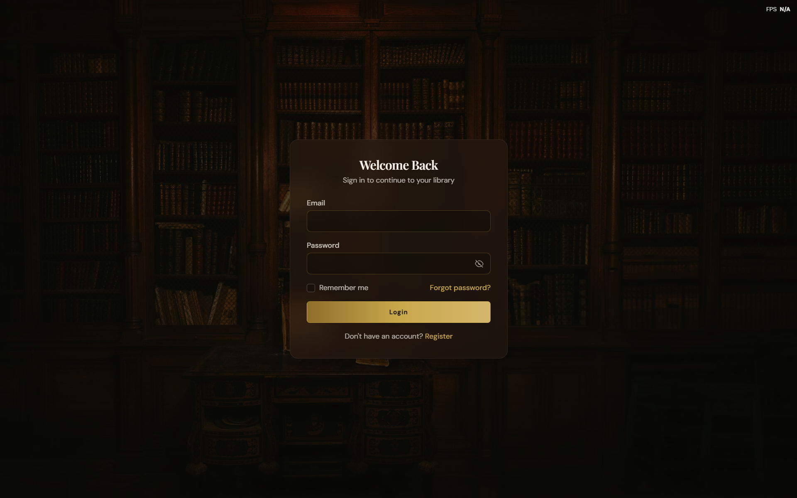
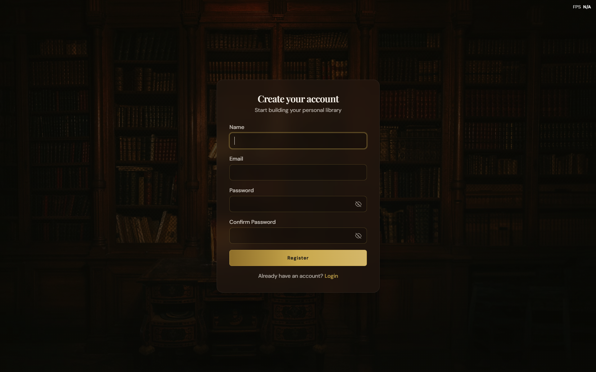
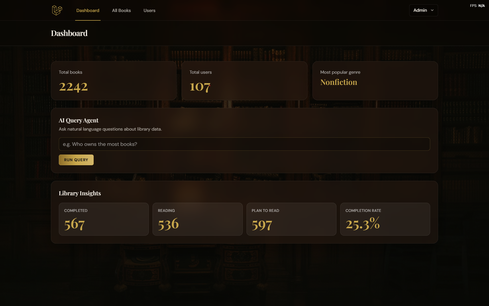
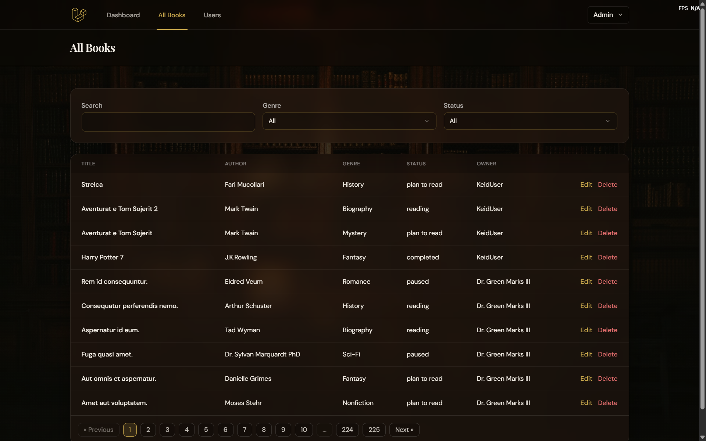
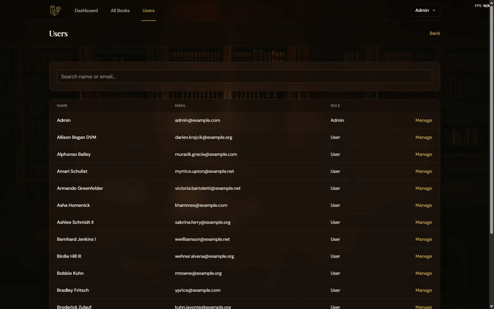
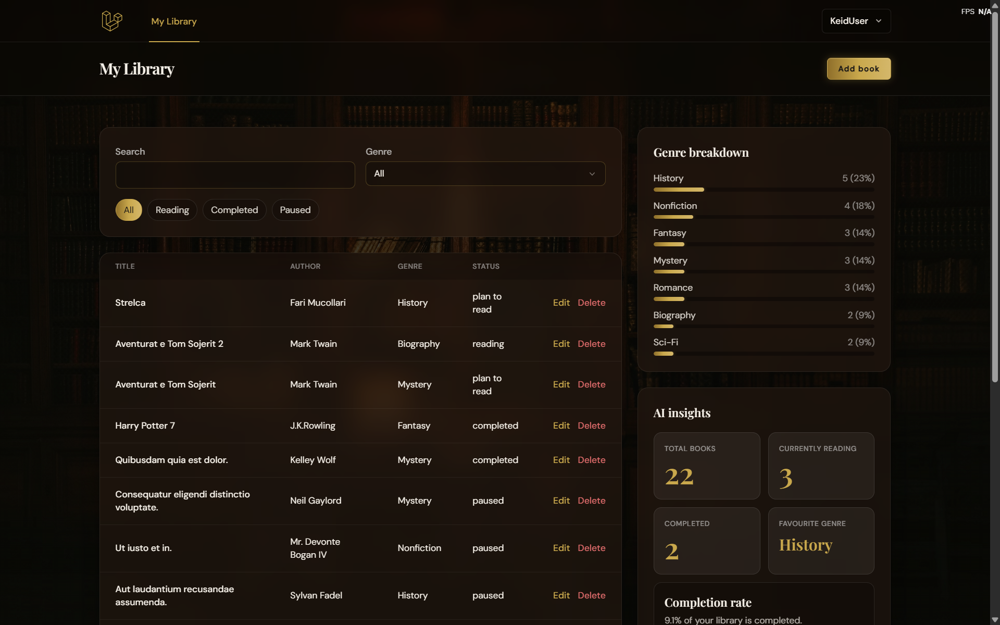
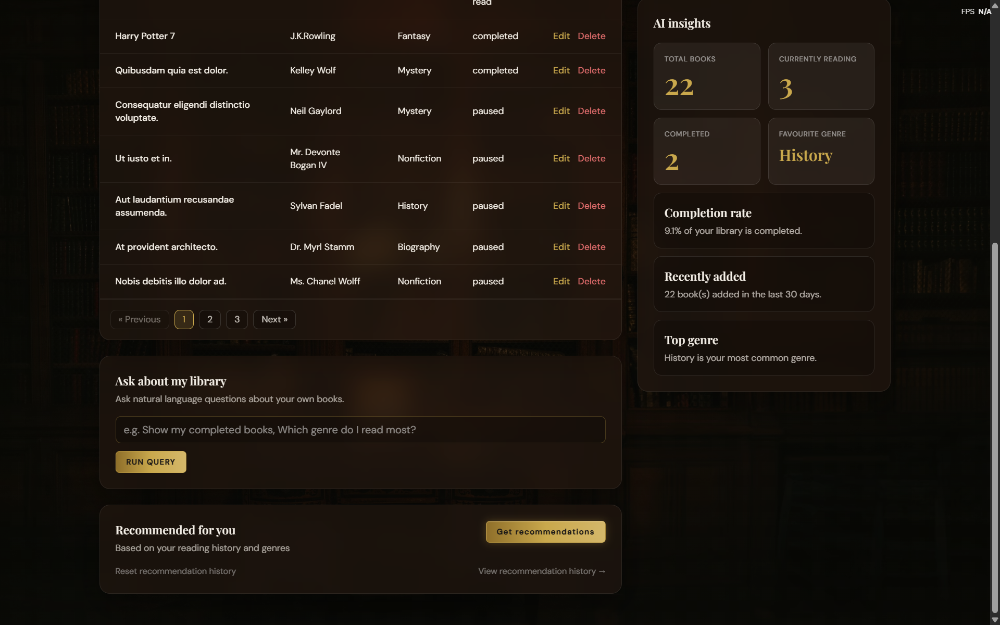
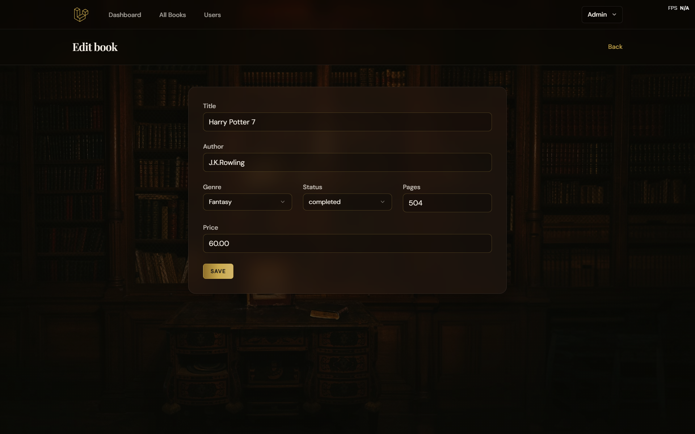
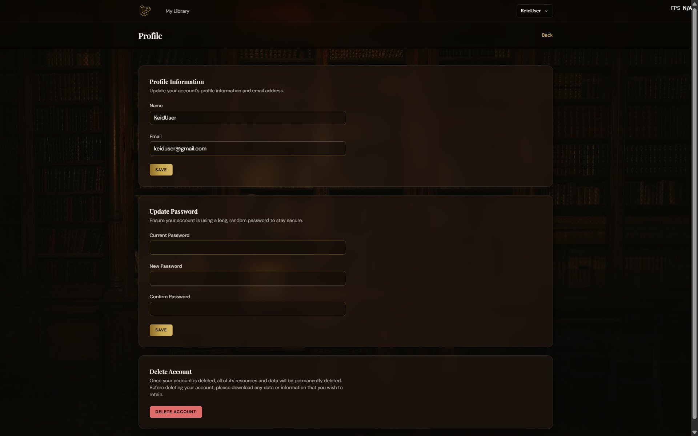

## First Time Setup (without Docker)

### Prerequisites
- **PHP**: 8.3+ (recommended 8.4)
- **Composer**
- **Node.js**: 18+ (recommended 22) + npm
- **Database**: MySQL (recommended) or SQLite for local development

### 1) Clone and install dependencies

```bash
git clone https://github.com/KejdMucollari/library-management-system
cd library-management-system
composer install
npm install
```

### 2) Configure environment
Copy the example env file and generate an app key:

```bash
cp .env.example .env
php artisan key:generate
```

Update `.env` with your database settings and Groq key:

```env
DB_CONNECTION=mysql
DB_HOST=127.0.0.1
DB_PORT=3306
DB_DATABASE=library
DB_USERNAME=root
DB_PASSWORD=secret

GROQ_API_KEY=add_the_key_here
```

### 3) Run migrations and seed the default admin

```bash
php artisan migrate
php artisan db:seed --class=AdminSeeder
```

Default admin credentials:

```text
Email: admin@library.com
Password: Admin@1234
```

Optional: seed dummy data (genres + users + books) for development:

```bash
# WARNING: This will wipe and recreate your database
php artisan migrate:fresh --seed
```

### 4) Start the app (two terminals)

Terminal A (Vite):

```bash
npm run dev
```

Terminal B (Laravel):

```bash
php artisan serve
```

Open the app:

```text
http://127.0.0.1:8000
```

### Optional: Run with Docker + MySQL

```bash
docker-compose up --build
```

Then open:

```text
http://127.0.0.1:8000
```

## Screenshots

### Login


### Register


### Admin Dashboard


### Admin Book Management


### Admin User Management


### User Library


### User Library - AI Features


### Book Edit


### User Profile Management

